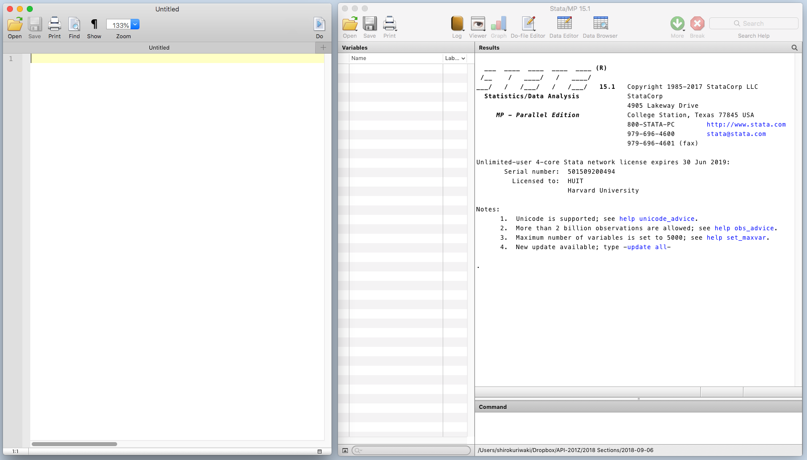
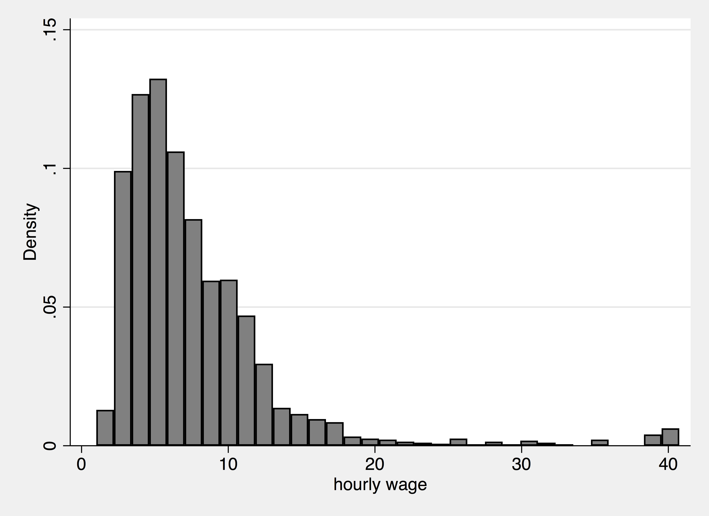
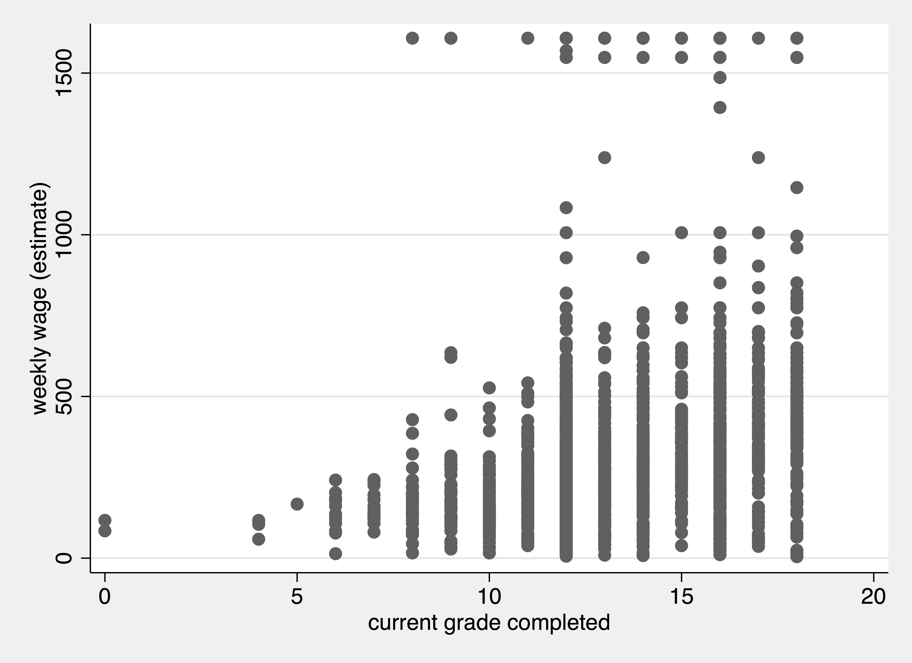
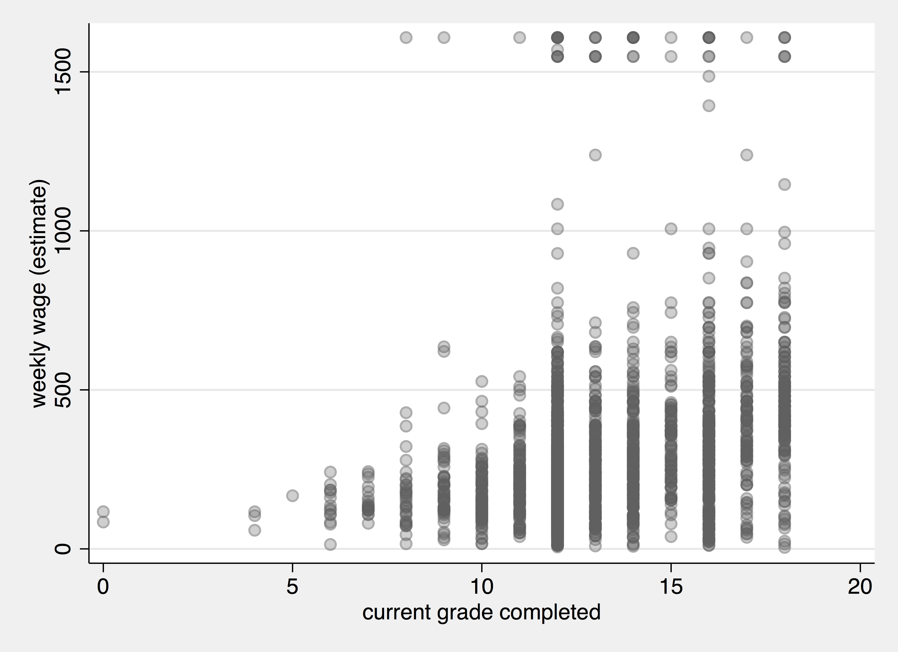
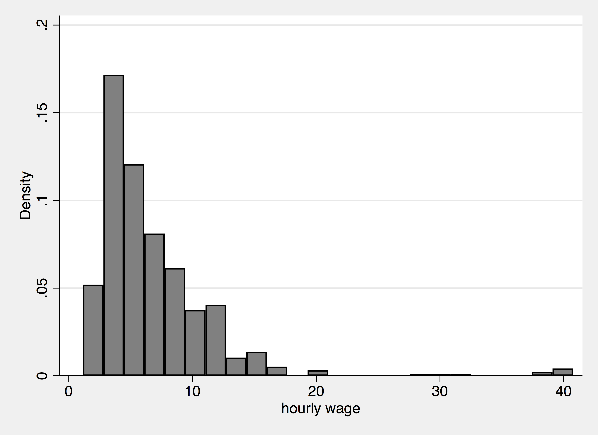
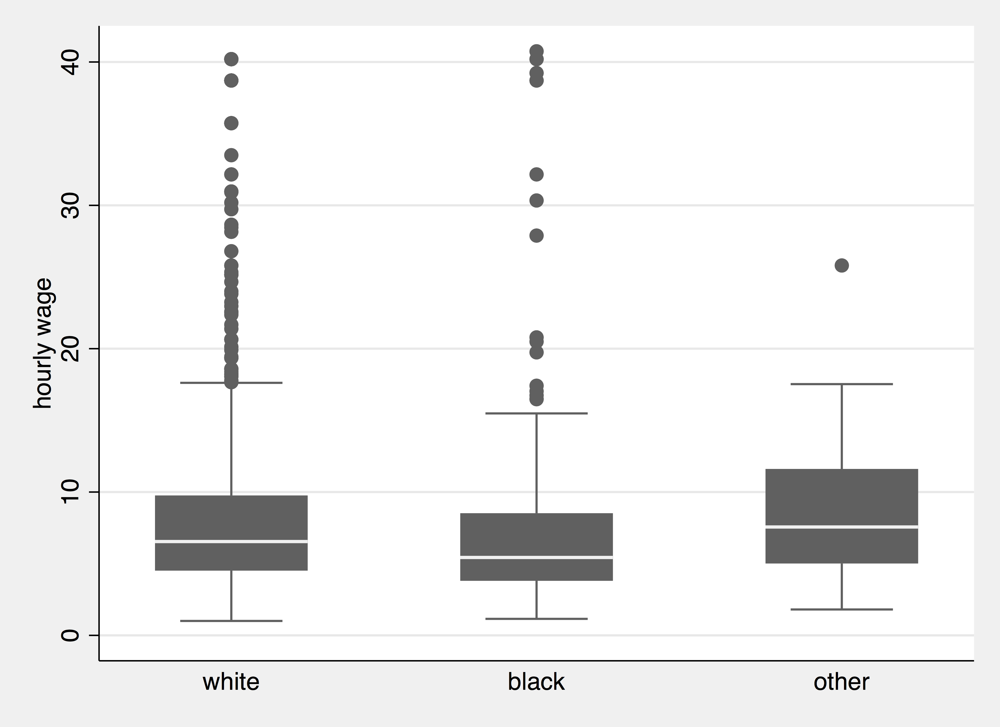

% API 201Z Stata Demonstration
% Shiro Kuriwaki
% September 6th, 2018

# Scripts and Console
How does one "do Stata"? We interact with Stata by sending the statistical program "commands". Commands can be anything from reading in a dataset to running a regression. 


{width=70%}


# Starting Fresh
Stata takes one dataset at a time and runs manipulations on it. To clear the memory (i.e. the dataset and other auxilarly objects) in Stata, the command is:

```
clear all
```

```{s, echo = FALSE}
clear all 
```

For the above code and all other Stata code in this document, you can run it after removing the period `.` in the beginning -- which indicates a command that was already entered.


# Getting Help

If you know the name of the function you want to use but aren't sure how to use it, use the help command by typing in `help` and then the name of the function.

```
help ivregress
```

If you do not know the exact name of the function, you can Google or search on Stata's help manual / search box. 

# Logging your Activity
Stata commands are stored in a script. You _can_ write commands directly into the command window to get similar results. However, it is often a bad idea to do your analysis through the command window because it is easy to forget the exact steps. Instead, you should save your commands in a script -- a `.do` file. When we ask for scripts on problem sets, we are looking for a script.


The `.do` file lacks a way to store the output of your commands. To store output you can generate a separate log file along with your `.do` scripts. To do so, 

start your `.do` file with 
```
log using kuriwaki_log.txt, text replace
```
where the filename `kuriwaki_log.txt` can be replaced by any name of your choice. 

Then at the end of your `.do` file, enter

```
log close
```

to close the log. 

Finally, you also might want to enter at the very first line, before `log using...`, the following

```
capture log close
```

to close any already opened logs (if they exist). 


# Reading in Data

When working in Stata, it's always an important first step to make sure you're in the right working directory (where you tell Stata what folder you want to work in).

`pwd` stands for "present working directory". `cd` stands for "change directory". `ls` stands for "list (the files in current directory)". `.` is shorthand for the current directory, `..` for the parent directory, and `~/` for your home directory.

For example,

```
cd "~/Dropbox/temp"
```

You will want to modify the path above to your own.


Now, load the `.dta` file provided into Stata:


{{1}}


Note that `use` is limited to `.dta` files; Stata's designated way of storing datasets. The most useful feature of a `.dta` format is that the data values comes with `labels`. For example, a `.dta` will be able to store the fact that the labels `female` and `male` correspond to values 1 and 2, respectively. 

Sometimes, your data will not come in a `.dta` format. A basic format is `.csv` -- standing for comma-separated-values. These files is like an Excel spreadsheet, but without any of the formatting (color, functions, comments). The csv is a common and desirable form in programming, as it can be read by any statistical program.

What if we needed to load a csv file?


{{2}}


We see that compared to the one-word `use`,  the Stata syntax is a bit more lengthy to read in a spreadsheet. Again, enter `help import` or `help import delimited` to understand thi son your  own. The help page tells us that we use `import delimited` and then the file name followed by the `using` word. 


# A comma separates commands and options

You will see the comma used many times in Stata code. On the left-side of the comma, you put the main command. On the right-side, you put secondary options. The comma often confuses first-time users. 


{{3}}


# Built-in Data
To go through how to analyze and review data, let's work with a dataset that is pre-loaded into the Stata app. 

The command `sysuse` is a command to use a data already baked into the system. Then `nlsw88` is one of the several datasets that are available. 

This is an extract from the 1988 National Longitudinal Survey of Women, which is a survey conducted by the Department of Labor. This extract contains about 2000 women in their 30s and 40s.


{{4}}


# Browsing Data

To look at the data we've just loaded in, use the command `browse` (or `br` for short):

```
browse
```

To get a list of the variables and the variable types:


{{5}}


# Summary Statistics
We can see that there are seventeen variables in this dataset. 


{{6}}


{{7}}


{{8}}


# New Variables
To create a new variable, use the `generate` (`gen` for short) command:

{{9}}


Stata, along with SPSS, adds "labels" to variables. You might think of the labels as "pretty names" that are more legible than "weekly_wage". labels show up in the Stata variable window and are also get used in graphs. It is often worth the extra effort to label your own variables.


{{10}}


If you want to redefine a variable, use the `replace` command:


{{11}}


To "drop" (delete) a variable:


{{12}}


# Counting 

To count the rows in your dataset,

{{13}}


What about counting only observations that match a certain condition? Use `if` at the end and the boolean conditions `==`, `!=`, `|`, and `&`.

{{14}}


 `tabulate` is an oft-used function for counting. We can either do a one-way or two-way tabulation.

One-way tabs is a tabulation of counts

{{15}}


Two-way tabs is referred to as a "crosstab"

{{16}}


# Visualizing Data 

First, I strongly recommend you re-set your default color palette 


{{17}}

which just makes for simpler and better looking plots.


The `hist` command will generate a histogram.


{{18}}

{width=70%}

Note that we have two commands -- `hist` and `graph export`. The first generates the figure within Stata; the second saves that figure as a file on your computer. Saving files will be make your workflow easier than saving files through the click-and-drag interface each time.


The `scatter` command will generate a scatterplot. Two variables...two dimensions. The y-variable comes first, then the x-variable:


{{19}}

{width=70%}

The `graph export` has many options beyond the default, and they come after a comma `,`. Again, this is a general Stata rule -- options come after a comma. Like all commands, use the command  `help` (as in `help graph export`) to see all of them. 

For example, we notice that the points above are overlapping and it is hard to distinguish whether a point overlap with one other point or 100s of other points. To this we could make the points transparent. 


{{20}}

{width=70%}


What if we only wanted to plot the wage of of blacks? We want to use a conditional `"if"` statement:


{{21}}

{width=70%}


To compare the distribution of the same variable across groups, a boxplot is useful

{{22}}

{width=70%}


What if we wanted to plot these two last scatterplots side-by-side? We can  give each one a name and then combine them:


{{23}}

{width=70%}


# A Cheat-sheet for commands
Unless you are already a Stata flow you will probably need to constantly refer to online and Stata-based resources on the command names and syntax of the commands you'd want to run. The Stata manual enclosed in the Stata Application and online message boards are helpful. A nice cheat-sheet of commands is here
<https://geocenter.github.io/StataTraining/pdf/AllCheatSheets.pdf>

and is also uploaded on Canvas (https://canvas.harvard.edu/courses/52520/files/folder/Programming-Resources)

# More Advanced Topics

* Writing loops, writing functions, and generating macros are some techniques that will greatly simplify -- or will be required -- for any work beyond the tabular data provided. We will introduce these concepts as necessary, but the tutorial here is a good overview: <http://data.princeton.edu/stata/programming.html>
* As you deal with multifaceted projects, how you organize your code and files will become increasingly important. Better workflow not only allows you to work faster, but reduces the number of errors that remain uncaught. Gentzkow and Shapiro have a good guide with battle-tested tips. <https://web.stanford.edu/~gentzkow/research/CodeAndData.pdf>
* Graphics should be crips and get to the point. You can change your graphics palette through some of the options (look at `help set scheme`) or others such as those by Daniel Bischoff: <https://www.stata.com/meeting/switzerland16/slides/bischof-switzerland16.pdf>


# Acknowledgements
For compilation, I used the `markstat` package by Germán Rodríguez. <http://data.princeton.edu/stata/markdown>. 
